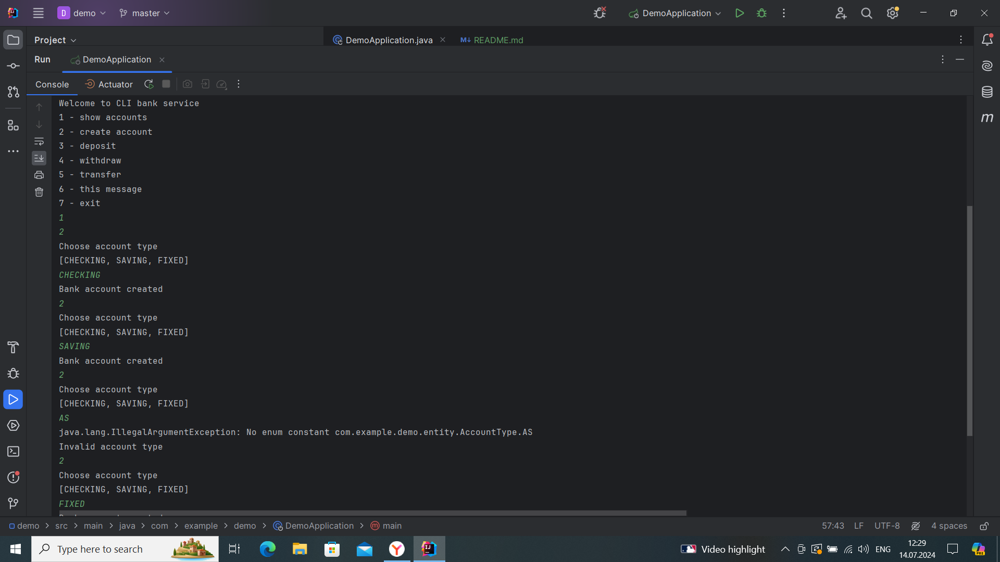
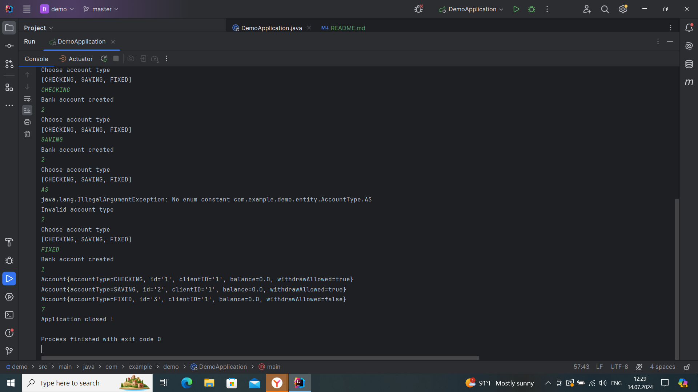

# CLI Bank Service

Welcome to CLI Bank Service - a simple command-line interface application for managing bank accounts.

## Features

- Show accounts
- Create account
- Deposit
- Withdraw
- Transfer
- Display this message
- Exit

## Screenshots

### Main Menu


- type 1 to show accounts - Displays all existing accounts.
- type 2 to create account - Allows you to create a new bank account.
- type 7 to stop the application - Exit the application.
#### features in progress..
Deposit - Deposit money into an account.
Withdraw - Withdraw money from an account.
Transfer - Transfer money between accounts.
This message - Display the menu options.

### Account Creation


## Usage

To start the application, run the following commands:

```sh
git clone https://github.com/yourusername/cli-bank-service.git